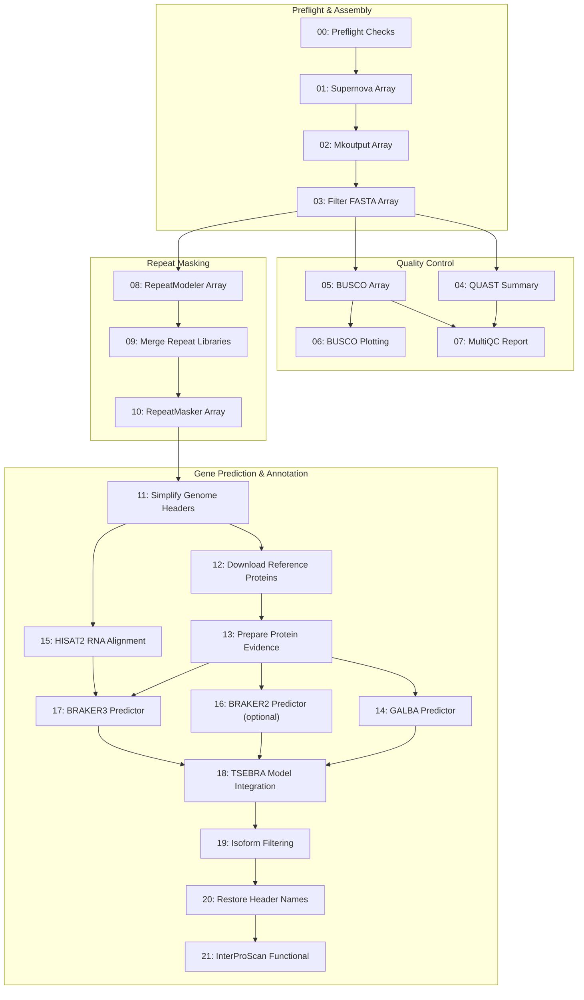

# Akodon Genome Assembly and Annotation Workflow

[](https://github.com/aleponce4/akodon-genome-assembly-workflow/actions/workflows/ci.yml)

SLURM workflow for assembly, repeat annotation, structural annotation, and functional annotation of an *Akodon* genome.

**Status: work in progress.** All 22 stages (00-21) are implemented and were run
on an institutional SLURM cluster - see [Validation & Execution
Scope](#validation--execution-scope) for what each stage group was run
against - and the workflow scaffolding (job arrays, dependency chains,
submission manifests, preflight, smoke tests) is complete.
The downstream reference-packaging work listed under [Remaining
work](#remaining-work) has not been done, so this is not a finished reference
release. The sample table and the SLURM account, partition, and QoS values that
ship here are placeholders rather than the settings used for the real run: see
[Configure before running](#configure-before-running).

## Overview & Architecture

The workflow is natively orchestrated via SLURM Bash scripts, utilizing job arrays (`--array`), explicit dependency chains (`--dependency=afterok`), and submission manifests. Native SLURM orchestration was selected to provide fine-grained control over job array bounds, queue submission throttling (`run_pipeline_chained.sh`), and stage recovery on institutional HPC clusters without requiring external workflow engine runtime dependencies.



Three stages are off in the shipped defaults: stage 06 BUSCO plotting
(`ENABLE_BUSCO_PLOT=0`), stage 16 BRAKER2 (`ENABLE_BRAKER2=0`, GALBA is the
protein-only predictor instead), and stage 21 InterProScan
(`ENABLE_INTERPROSCAN=0`). The whole annotation branch (11-21) also needs
`ENABLE_ANNOTATION=1`, which is off by default too.

## Workflow Stages

Stage numbers are the numbers in the `slurm/NN_*.sh` filenames, the `stage_id`
column of the submission manifest, and the `PIPELINE_START_STAGE` /
`PIPELINE_END_STAGE` range. Each number belongs to exactly one stage.

Preflight:

- **00 preflight**: checks line endings, tools, paths, FASTQs, and evidence files.

Assembly:

- **01 Supernova**: assembles each sample from raw 10x linked-read FASTQs.
- **02 Supernova mkoutput**: exports the assembly FASTA used by downstream steps.
- **03 seqkit**: removes scaffolds shorter than the configured minimum length.
- **04 QUAST**: summarizes contiguity and basic assembly statistics.
- **05 BUSCO**: estimates gene-space completeness using the configured lineage.
- **06 BUSCO plot**: optionally makes summary plots from BUSCO results.
- **07 MultiQC**: combines QUAST and BUSCO summaries into one QC folder.
- **08 RepeatModeler**: builds a sample-specific repeat library.
- **09 CD-HIT/seqkit**: merges sample repeat libraries and filters redundancy.
- **10 RepeatMasker**: softmasks repeats before annotation.

Annotation:

- **11 simplifyFastaHeaders.pl**: simplifies masked genome FASTA headers for annotation tools.
- **12 NCBI Datasets**: downloads reference protein datasets listed in the input TSV.
- **13 simplifyFastaHeaders.pl**: merges and simplifies reference protein FASTA files.
- **14 GALBA**: predicts genes with protein evidence.
- **15 HISAT2/samtools**: aligns RNA-seq reads to each simplified assembly for BRAKER3 evidence.
- **16 BRAKER2**: optional protein-evidence predictor (disabled by default in favor of GALBA).
- **17 BRAKER3**: predicts genes with RNA BAM and protein evidence.
- **18 TSEBRA**: combines selected GALBA/BRAKER prediction sets.
- **19 get_longest_isoform.py**: keeps the longest isoform per gene model.
- **20 header restore**: writes final genome and GTF files with original contig names.
- **21 InterProScan**: adds functional annotations to the selected protein set.

### Validation & Execution Scope

| Stage Group | Execution Environment | Validation Level | Notes |
| :--- | :--- | :--- | :--- |
| **Assembly (01–03)** | Institutional SLURM HPC | Real *Akodon* WGS Data | Validated on 4 10x linked-read samples |
| **QC & Masking (04–10)** | Institutional SLURM HPC | Real *Akodon* Assembly Data | BUSCO (Glires), RepeatModeler library merge |
| **Annotation (11–21)** | Institutional SLURM HPC | Real *Akodon* & Synthetic Fixtures | GALBA + BRAKER3 via TSEBRA model selection |
| **Smoke Test Suite** | GitHub Actions & Local Shell | Mock File Contracts | End-to-end output assertions plus a header integrity check (stage 20 output vs. the stage 11 header map) |

The underlying *Akodon* sequencing data is unpublished and is not part of this
repository. No reads, assemblies, sample identifiers, or per-sample results are
committed here; the sample table ships with synthetic placeholder rows.

### Remaining work

* Pick one primary assembly as the working reference using QUAST, BUSCO, gaps, and contamination checks.
* Map the original WGS reads back to the reference and make coverage, repeat, and mappability masks.
* Package the final FASTA, GTF/GFF, repeat annotations, and masks as the GWAS reference bundle.

## Main Tools

- Supernova
- `seqkit`
- QUAST
- BUSCO
- MultiQC
- RepeatModeler / RepeatMasker via `dfam/tetools`
- GALBA
- HISAT2 / samtools
- BRAKER2 / BRAKER3
- TSEBRA
- InterProScan

## Files

- [`config/pipeline.env`](config/pipeline.env): pipeline paths and Slurm settings; starts with the site-configuration block you must review
- [`config/bootstrap.env`](config/bootstrap.env): dependency bootstrap settings
- [`config/samples.tsv`](config/samples.tsv): sample table (synthetic placeholder rows)
- [`config/smoke_samples.tsv`](config/smoke_samples.tsv): single-sample table used by the smoke tests
- [`run_pipeline.sh`](run_pipeline.sh): full workflow submission
- [`run_smoke_test.sh`](run_smoke_test.sh): smoke test
- [`run_slurm_smoke_test.sh`](run_slurm_smoke_test.sh): real-SLURM toy submission
- [`slurm/`](slurm): numbered stage scripts
- [`scripts/check_pipeline_connections.sh`](scripts/check_pipeline_connections.sh): preflight path check
- [`scripts/hpc/bootstrap_dependencies.sh`](scripts/hpc/bootstrap_dependencies.sh): HPC bootstrap
- [`scripts/hpc/prepare_repeatmasker_famdb.sh`](scripts/hpc/prepare_repeatmasker_famdb.sh): populates the Dfam FamDB directory used by the RepeatMasker Dfam rounds
- [`tests/test_pipeline.py`](tests/test_pipeline.py): unit and contract tests (see [Tests and CI](#tests-and-ci))
- [`LICENSE`](LICENSE) and [`THIRD_PARTY_NOTICES.md`](THIRD_PARTY_NOTICES.md): see [License](#license)

## Inputs

- raw 10x FASTQs in `data/`
- sample table in `config/samples.tsv`
- BUSCO lineage data
- container images for RepeatModeler/RepeatMasker, BRAKER, GALBA, and InterProScan
- Dfam FamDB partitions in `annotation/famdb/` (see [Dfam FamDB directory](#dfam-famdb-directory))
- trimmed RNA-seq FASTQs in `RNA_seq/trimmed_data/` for BRAKER3 evidence generation
- annotation inputs in `annotation/input/` such as `ncbi_dataset.tsv`, `Vertebrata.fa`, TSEBRA configs, and optional precomputed per-sample RNA BAMs for BRAKER3

`annotation/input/`, `annotation/original_headers/`, and `annotation/famdb/` are
git-ignored: you populate them locally, and nothing from them is committed.

### Dfam FamDB directory

`REPEATMASKER_ENABLE_DFAM_ROUNDS=1` is the default, and stage 10 then runs two
Dfam-based masking rounds (simple, then complex repeats) before the two rounds
that use the RepeatModeler libraries. Those Dfam rounds need a FamDB directory
(`REPEATMASKER_FAMDB_DIR`, default `annotation/famdb/`) holding the Dfam HDF5
partitions: the root file (`*_full.0.h5`) plus the clade partition for your
species (`REPEATMASKER_FAMDB_PARTITION`, default `7` for rodents). Stage 10
binds it into the container at `/opt/RepeatMasker/Libraries/famdb` and fails if
it is missing; stage 00 preflight and
`scripts/check_pipeline_connections.sh` report it as MISSING until it exists.

Populate it with the helper script, which copies the FamDB root out of the
`dfam/tetools` container and then downloads the clade partition from dfam.org:

```bash
# run once on a node with Singularity to seed the container FamDB files,
# then again where the machine has outbound network access
bash scripts/hpc/prepare_repeatmasker_famdb.sh config/pipeline.env
```

Set `REPEATMASKER_ENABLE_DFAM_ROUNDS=0` instead if you want to mask with the
RepeatModeler libraries only and skip the Dfam rounds and this download.

Default RNA-seq FASTQ layout:

```text
RNA_seq/trimmed_data/A1_R1_trimmed.fastq.gz
RNA_seq/trimmed_data/A1_R2_trimmed.fastq.gz
...
RNA_seq/trimmed_data/B5_R1_trimmed.fastq.gz
RNA_seq/trimmed_data/B5_R2_trimmed.fastq.gz
```

Default BRAKER3 BAM layout:

One directory per `sample_id` in `config/samples.tsv`; with the placeholder
sample table that is:

```text
RNA_seq/bam_files/SAMPLE01/*.bam
RNA_seq/bam_files/SAMPLE02/*.bam
RNA_seq/bam_files/SAMPLE03/*.bam
RNA_seq/bam_files/SAMPLE04/*.bam
```

## Output Layout

The workflow writes stage outputs under fixed directories from
[`config/pipeline.env`](config/pipeline.env). SLURM logs are separate from data
outputs.

```text
logs/slurm/                         sbatch stdout/stderr and submission manifests
output/preflight/                   tool versions and preflight checks
output/supernova_runs/              Supernova run directories
output/pseudohap/                   canonical mkoutput FASTA files
output/filtered_fasta/              scaffold-filtered assemblies
output/QUAST_results_filtered/      QUAST reports
output/BUSCO_results_filtered/      BUSCO sample outputs
output/multiQC_filtered/            MultiQC report and qc_summary.tsv
output/Repeat_modeler/              RepeatModeler databases and merged libraries
output/Repeat_masker/               sample-specific masked assemblies
RNA_seq/bam_files/                  BRAKER3 RNA BAM evidence
RNA_seq/log_files/                  HISAT2 and samtools flagstat logs
RNA_seq/tmp/                        temporary RNA alignment files
annotation/input/                   simplified genomes, maps, protein inputs
annotation/output/<sample_id>/      GALBA/BRAKER/TSEBRA/isoform outputs
annotation/original_headers/        restored genome and GTF deliverables
annotation_functional/output/       InterProScan outputs
```

The stage scripts also `cd` into the expected output/work directory before
calling external tools. That keeps auxiliary files from landing in the repo root
if a tool writes side outputs relative to the current directory.

## Configure before running

Every default lives in [`config/pipeline.env`](config/pipeline.env) and
[`config/bootstrap.env`](config/bootstrap.env), and can be overridden by
exporting the same variable name. The file opens with a `SITE CONFIGURATION`
comment block; read it before you submit anything.

These three are site-specific and ship as placeholders:

- `SBATCH_ACCOUNT` - the shipped default (`ACF-UTKXXXX`) is deliberately not a
  real allocation. `run_pipeline.sh` and
  `scripts/submit_stage_chunk_and_chain.sh` abort while the placeholder is in
  place, so set your own first:
  `export SBATCH_ACCOUNT="YOUR-ALLOCATION-CODE"`.
- Partition and QoS names (`*_PARTITION`, `*_QOS`) plus walltimes, CPU counts,
  and memory (`*_TIME`, `*_CPUS`, `*_MEM`) - the values here (`campus`,
  `campus-bigmem`, `short`, `long`, `long-bigmem`, 526G Supernova nodes) came
  from one particular cluster. Check `sinfo -s` and `sacctmgr show qos`.
- `config/samples.tsv` - ships with synthetic rows
  (`SAMPLE01`/`EXAMPLE-LIB-0001` ...). `sample_id` names the outputs;
  `fastq_sample` is the FASTQ filename stem matched as
  `${fastq_sample}*R1/R2*.fastq.gz` under `DATA_DIR`.

Other commonly changed settings:

- `DATA_DIR`
- `SUPERNOVA_BIN`
- `REPEATMODELER_IMAGE`
- `BUSCO_LINEAGE_DIR`
- `REPEATMASKER_FAMDB_DIR` / `REPEATMASKER_ENABLE_DFAM_ROUNDS`
- `BRAKER_SIF`
- `GALBA_SIF`
- `INTERPROSCAN_SIF`
- `INTERPROSCAN_DATA_DIR` (keep its version in step with the InterProScan image
  and data archive pinned in `config/bootstrap.env`)
- `ANNOTATION_SAMPLE_MODE=all`
- `ENABLE_RNA_ALIGNMENT`
- `RNA_ALIGN_FASTQ_DIR`
- `RNA_ALIGN_LIBRARY_IDS`
- `RNA_ALIGN_R1_SUFFIX` / `RNA_ALIGN_R2_SUFFIX`
- `BRAKER3_BAM_GLOB_TEMPLATE`
- `ENABLE_PREFLIGHT`

## Bootstrap

```bash
bash scripts/hpc/probe_node_capabilities.sh
bash scripts/hpc/bootstrap_dependencies.sh install config/bootstrap.env
bash scripts/hpc/bootstrap_dependencies.sh verify config/bootstrap.env
```

Use `install-light` on login nodes to skip large container and InterProScan
database downloads:

```bash
bash scripts/hpc/bootstrap_dependencies.sh install-light config/bootstrap.env
```

Automated by default:

- repo-local Conda environments
- BUSCO lineage download
- `tetools_latest.sif`
- InterProScan image and data
- `get_longest_isoform.py`
- default TSEBRA config files

Still manual by default:

- Supernova if the legacy path is unavailable
- BRAKER and GALBA SIFs unless source paths are provided
- the Dfam FamDB directory (`scripts/hpc/prepare_repeatmasker_famdb.sh`, see
  [Dfam FamDB directory](#dfam-famdb-directory))
- biological inputs such as `Vertebrata.fa`, `ncbi_dataset.tsv`, and RNA FASTQs

## Run

Preflight:

```bash
bash scripts/check_pipeline_connections.sh config/pipeline.env
bash scripts/hpc/bootstrap_dependencies.sh verify config/bootstrap.env
```

Submit:

```bash
bash run_pipeline.sh config/pipeline.env
```

Submit in chained chunks to avoid holding every downstream job in the queue at
once:

```bash
ENABLE_ANNOTATION=1 ENABLE_INTERPROSCAN=0 bash run_pipeline_chained.sh config/pipeline.env
```

This submits stages in the small ranges from `PIPELINE_STAGE_CHUNKS`
(`00-03`, `04-10`, `11-13`, `14-17`, `18-21` by default); each next range is
submitted by a tiny SLURM job only after the previous range finishes
successfully.

Resume from a stage after fixing a failed run:

```bash
PIPELINE_START_STAGE=04 bash run_pipeline.sh config/pipeline.env
```

Each submission writes a manifest under `logs/slurm/submissions/`. Use:

```bash
bash scripts/summarize_slurm_run.sh logs/slurm/submissions/run_YYYYMMDD_HHMMSS_PID_jobs.tsv
bash scripts/cancel_submitted_run.sh logs/slurm/submissions/run_YYYYMMDD_HHMMSS_PID_jobs.tsv
bash scripts/make_run_report.sh config/pipeline.env
```

The run report writes a small text index and resource TSV under
`logs/slurm/run_reports/`, pointing to the main outputs and any non-completed
SLURM stages.

Smoke test:

```bash
bash run_smoke_test.sh config/smoke_test.env
```

Real SLURM toy test:

```bash
bash run_slurm_smoke_test.sh config/slurm_toy.env
```

The local smoke test runs mock stages directly. The SLURM toy test submits the same dependency chain with tiny resources and writes under `slurm_toy/`.

## Tests and CI

The CI badge at the top of this file tracks
[`.github/workflows/ci.yml`](.github/workflows/ci.yml), which runs four things on
every push and pull request to `main`/`master` (and on manual dispatch):

1. **ShellCheck** over `run_*.sh`, `scripts/`, and `slurm/`.
2. **`bash -n`** over every `*.sh` file in the repository.
3. **Unit and contract tests** - `python3 tests/test_pipeline.py`
   ([`tests/test_pipeline.py`](tests/test_pipeline.py), stdlib `unittest`, no
   dependencies). These exercise `scripts/lib/common.sh` helpers (`truthy`, the
   sample-table lookups) against the real `config/pipeline.env`, check the
   stage-number normalization and dependency-joining logic used by
   `run_pipeline.sh`, and feed a synthetic submission manifest through
   `scripts/summarize_slurm_run.sh` to pin down the manifest format.
4. **End-to-end smoke test** - `bash run_smoke_test.sh config/smoke_test.env`,
   which builds synthetic inputs and then runs stages 01-21 in mock mode under
   `smoke_test/` (stage 00 preflight is not part of the smoke run, and stage 16
   BRAKER2 stays disabled), before asserting the output contracts in
   `scripts/verify_smoke_test_outputs.sh`: expected files exist and are
   non-empty, the MultiQC summary mentions each sample, and the stage 20
   restored genome headers match the stage 11 header map exactly, in the same
   order and count.

Run the same checks locally:

```bash
python3 tests/test_pipeline.py
bash run_smoke_test.sh config/smoke_test.env
find . -name "*.sh" -exec bash -n {} +
```

No real data, credentials, or cluster access is needed for any of them.

## License

The workflow code in this repository is released under the MIT License
([`LICENSE`](LICENSE)).

`job_scripts/bin/simplifyFastaHeaders.pl` is third-party code vendored from the
AUGUSTUS project and is **not** covered by that license; see
[`THIRD_PARTY_NOTICES.md`](THIRD_PARTY_NOTICES.md) for its attribution and
upstream license, along with the other third-party tools and data this workflow
downloads at bootstrap time.
