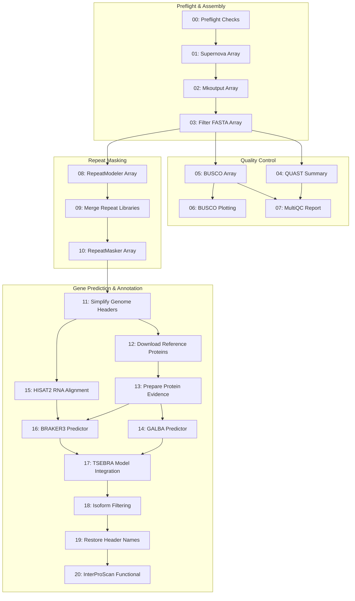

# Akodon Genome Assembly and Annotation Workflow

[](https://github.com/apflores/akodon-genome-assembly-workflow/actions/workflows/ci.yml)

SLURM workflow for assembly, repeat annotation, structural annotation, and functional annotation of an *Akodon* genome. This repository represents a completed case study snapshot reorganizing HPC job scripts into a reproducible workflow.

## Overview & Architecture

The workflow is natively orchestrated via SLURM Bash scripts, utilizing job arrays (`--array`), explicit dependency chains (`--dependency=afterok`), and submission manifests. Native SLURM orchestration was selected to provide fine-grained control over job array bounds, queue submission throttling (`run_pipeline_chained.sh`), and stage recovery on institutional HPC clusters without requiring external workflow engine runtime dependencies.



## Workflow Stages

Assembly:

1. **Supernova**: assembles each sample from raw 10x linked-read FASTQs.
2. **Supernova mkoutput**: exports the assembly FASTA used by downstream steps.
3. **seqkit**: removes scaffolds shorter than the configured minimum length.
4. **QUAST**: summarizes contiguity and basic assembly statistics.
5. **BUSCO**: estimates gene-space completeness using the configured lineage.
6. **BUSCO plot**: optionally makes summary plots from BUSCO results.
7. **MultiQC**: combines QUAST and BUSCO summaries into one QC folder.
8. **RepeatModeler**: builds a sample-specific repeat library.
9. **CD-HIT/seqkit**: merges sample repeat libraries and filters redundancy.
10. **RepeatMasker**: softmasks repeats before annotation.

Annotation:

0. **Preflight**: checks line endings, tools, paths, FASTQs, and evidence files.
11. **simplifyFastaHeaders.pl**: simplifies masked genome FASTA headers for annotation tools.
12. **NCBI Datasets**: downloads reference protein datasets listed in the input TSV.
13. **simplifyFastaHeaders.pl**: merges and simplifies reference protein FASTA files.
14. **GALBA**: predicts genes with protein evidence.
15. **BRAKER2**: optional protein-evidence predictor (disabled by default in favor of GALBA).
15. **HISAT2/samtools**: aligns RNA-seq reads to each simplified assembly for BRAKER3 evidence.
16. **BRAKER3**: predicts genes with RNA BAM and protein evidence.
17. **TSEBRA**: combines selected GALBA/BRAKER prediction sets.
18. **get_longest_isoform.py**: keeps the longest isoform per gene model.
19. **header restore**: writes final genome and GTF files with original contig names.
20. **InterProScan**: adds functional annotations to the selected protein set.

### Validation & Execution Scope

| Stage Group | Execution Environment | Validation Level | Notes |
| :--- | :--- | :--- | :--- |
| **Assembly (01–03)** | Institutional SLURM HPC | Real *Akodon* WGS Data | Validated on 4 10x linked-read samples |
| **QC & Masking (04–10)** | Institutional SLURM HPC | Real *Akodon* Assembly Data | BUSCO (Glires), RepeatModeler library merge |
| **Annotation (11–20)** | Institutional SLURM HPC | Real *Akodon* & Synthetic Fixtures | GALBA + BRAKER3 via TSEBRA model selection |
| **Smoke Test Suite** | GitHub Actions & Local Shell | Mock File Contracts | End-to-end output assertion & header integrity check |


Still to do:

* Pick one primary assembly as the working reference using QUAST, BUSCO, gaps, and contamination checks.
* Map the original WGS reads back to the reference and make coverage, repeat, and mappability masks.
* Package the final FASTA, GTF/GFF, repeat annotations, and masks as the GWAS reference bundle.

## Main Tools

- Supernova
- `seqkit`
- QUAST
- BUSCO
- MultiQC
- RepeatModeler / RepeatMasker via `dfam/tetools`
- GALBA
- HISAT2 / samtools
- BRAKER2 / BRAKER3
- TSEBRA
- InterProScan

## Files

- [`config/pipeline.env`](config/pipeline.env): pipeline paths and Slurm settings
- [`config/bootstrap.env`](config/bootstrap.env): dependency bootstrap settings
- [`config/samples.tsv`](config/samples.tsv): sample metadata
- [`run_pipeline.sh`](run_pipeline.sh): full workflow submission
- [`run_smoke_test.sh`](run_smoke_test.sh): smoke test
- [`run_slurm_smoke_test.sh`](run_slurm_smoke_test.sh): real-SLURM toy submission
- [`slurm/`](slurm): numbered stage scripts
- [`scripts/check_pipeline_connections.sh`](scripts/check_pipeline_connections.sh): preflight path check
- [`scripts/hpc/bootstrap_dependencies.sh`](scripts/hpc/bootstrap_dependencies.sh): HPC bootstrap

## Inputs

- raw 10x FASTQs in `data/`
- sample table in `config/samples.tsv`
- BUSCO lineage data
- container images for RepeatModeler/RepeatMasker, BRAKER, GALBA, and InterProScan
- trimmed RNA-seq FASTQs in `RNA_seq/trimmed_data/` for BRAKER3 evidence generation
- annotation inputs such as `ncbi_dataset.tsv`, protein FASTA, TSEBRA configs, and optional precomputed per-sample RNA BAMs for BRAKER3

Default RNA-seq FASTQ layout:

```text
RNA_seq/trimmed_data/A1_R1_trimmed.fastq.gz
RNA_seq/trimmed_data/A1_R2_trimmed.fastq.gz
...
RNA_seq/trimmed_data/B5_R1_trimmed.fastq.gz
RNA_seq/trimmed_data/B5_R2_trimmed.fastq.gz
```

Default BRAKER3 BAM layout:

```text
RNA_seq/bam_files/0337/*.bam
RNA_seq/bam_files/0338/*.bam
RNA_seq/bam_files/0339/*.bam
RNA_seq/bam_files/0340/*.bam
```

## Output Layout

The workflow writes stage outputs under fixed directories from
[`config/pipeline.env`](config/pipeline.env). SLURM logs are separate from data
outputs.

```text
logs/slurm/                         sbatch stdout/stderr and submission manifests
output/preflight/                   tool versions and preflight checks
output/supernova_runs/              Supernova run directories
output/pseudohap/                   canonical mkoutput FASTA files
output/filtered_fasta/              scaffold-filtered assemblies
output/QUAST_results_filtered/      QUAST reports
output/BUSCO_results_filtered/      BUSCO sample outputs
output/multiQC_filtered/            MultiQC report and qc_summary.tsv
output/Repeat_modeler/              RepeatModeler databases and merged libraries
output/Repeat_masker/               sample-specific masked assemblies
RNA_seq/bam_files/                  BRAKER3 RNA BAM evidence
RNA_seq/log_files/                  HISAT2 and samtools flagstat logs
RNA_seq/tmp/                        temporary RNA alignment files
annotation/input/                   simplified genomes, maps, protein inputs
annotation/output/<sample_id>/      GALBA/BRAKER/TSEBRA/isoform outputs
annotation/original_headers/        restored genome and GTF deliverables
annotation_functional/output/       InterProScan outputs
```

The stage scripts also `cd` into the expected output/work directory before
calling external tools. That keeps auxiliary files from landing in the repo root
if a tool writes side outputs relative to the current directory.

## Setup

Review:

- [`config/pipeline.env`](config/pipeline.env)
- [`config/bootstrap.env`](config/bootstrap.env)

Common settings:

- `DATA_DIR`
- `SUPERNOVA_BIN`
- `REPEATMODELER_IMAGE`
- `BUSCO_LINEAGE_DIR`
- `BRAKER_SIF`
- `GALBA_SIF`
- `INTERPROSCAN_SIF`
- `INTERPROSCAN_DATA_DIR`
- Slurm account, partition, QoS, memory, and walltime
- `ANNOTATION_SAMPLE_MODE=all`
- `ENABLE_RNA_ALIGNMENT`
- `RNA_ALIGN_FASTQ_DIR`
- `RNA_ALIGN_LIBRARY_IDS`
- `RNA_ALIGN_R1_SUFFIX` / `RNA_ALIGN_R2_SUFFIX`
- `BRAKER3_BAM_GLOB_TEMPLATE`
- `ENABLE_PREFLIGHT`

## Bootstrap

```bash
bash scripts/hpc/probe_node_capabilities.sh
bash scripts/hpc/bootstrap_dependencies.sh install config/bootstrap.env
bash scripts/hpc/bootstrap_dependencies.sh verify config/bootstrap.env
```

Use `install-light` on login nodes to skip large container and InterProScan
database downloads:

```bash
bash scripts/hpc/bootstrap_dependencies.sh install-light config/bootstrap.env
```

Automated by default:

- repo-local Conda environments
- BUSCO lineage download
- `tetools_latest.sif`
- InterProScan image and data
- `get_longest_isoform.py`
- default TSEBRA config files

Still manual by default:

- Supernova if the legacy path is unavailable
- BRAKER and GALBA SIFs unless source paths are provided
- biological inputs such as `Vertebrata.fa`, `ncbi_dataset.tsv`, and RNA FASTQs

## Run

Preflight:

```bash
bash scripts/check_pipeline_connections.sh config/pipeline.env
bash scripts/hpc/bootstrap_dependencies.sh verify config/bootstrap.env
```

Submit:

```bash
bash run_pipeline.sh config/pipeline.env
```

Submit in chained chunks to avoid holding every downstream job in the queue at
once:

```bash
ENABLE_ANNOTATION=1 ENABLE_INTERPROSCAN=0 bash run_pipeline_chained.sh config/pipeline.env
```

This submits stages in small ranges such as `00-03`, `04-10`, `11-13`,
`14-16`, and `17-20`; each next range is submitted by a tiny SLURM job only
after the previous range finishes successfully.

Resume from a stage after fixing a failed run:

```bash
PIPELINE_START_STAGE=04 bash run_pipeline.sh config/pipeline.env
```

Each submission writes a manifest under `logs/slurm/submissions/`. Use:

```bash
bash scripts/summarize_slurm_run.sh logs/slurm/submissions/run_YYYYMMDD_HHMMSS_PID_jobs.tsv
bash scripts/cancel_submitted_run.sh logs/slurm/submissions/run_YYYYMMDD_HHMMSS_PID_jobs.tsv
bash scripts/make_run_report.sh config/pipeline.env
```

The run report writes a small text index and resource TSV under
`logs/slurm/run_reports/`, pointing to the main outputs and any non-completed
SLURM stages.

Smoke test:

```bash
bash run_smoke_test.sh config/smoke_test.env
```

Real SLURM toy test:

```bash
bash run_slurm_smoke_test.sh config/slurm_toy.env
```

The local smoke test runs mock stages directly. The SLURM toy test submits the same dependency chain with tiny resources and writes under `slurm_toy/`.
